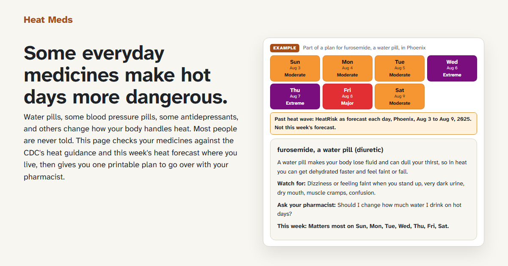

# Heat Meds

Type in your medicines and ZIP code. Get one printable page that says which of your medicines make hot days more dangerous, what this week's heat looks like where you live, and what to ask your pharmacist. It never tells anyone to stop a medicine.

A proof of concept built for the Devpost Build With AI: Basics hackathon. Planning documents are in `devpost/`.

**Live site:** https://usv240.github.io/heat-meds/ (press "Try an example", no account needed)



## Who it is for

Older adults and the people who look after them. Some everyday medicines, such as water pills, some blood pressure pills, and some antidepressants, change how the body handles heat. In September 2025 the CDC asked clinicians to plan for this with their patients. Patients had no tool to start that conversation themselves.

## Results on real prescriptions

The 300 most-prescribed US medicines, derived from the AHRQ MEPS 2024 prescription survey, were run through the same code the site uses (run of September 30, 2026; the [Evidence page](https://usv240.github.io/heat-meds/evidence.html) reads the numbers straight from `data/evidence.json`):

- 0 medicine cards without an exact CDC quote (enforced in code)
- 0 plans that tell anyone to stop, skip, or change a dose
- 75.0% agreement with UK Health Security Agency guidance and 82.3% with Health Canada guidance, used as independent answer keys
- Every disagreement listed with a reason, including the 18 medicines flagged here that neither the UK nor Canada lists

This measures agreement with national guidance, not clinical outcomes.

## How this is different

The CDC guidance is a table for clinicians. The HeatRisk forecast and the CDC HeatRisk Dashboard show heat for a place, not for a medicine list. Pill reminder apps have no heat data. Heat Meds joins a personal medicine list to the local heat forecast and gives one sourced page to take to a pharmacist.

## What it does

- Resolves medicine names, brand or generic, through the National Library of Medicine's RxNorm, and never guesses: an uncertain match becomes a "Did you mean" you have to tap.
- Looks up each ingredient's drug class (RxClass, ATC codes) and checks it against a hand-curated rules file built from the CDC's heat and medications guidance for clinicians. Every card carries the exact CDC quote, link, and the date it was checked.
- Shows the next seven days of National Weather Service HeatRisk for your ZIP, each day with a color and a word, and a replay of a real past heat wave (Phoenix, Aug 3 to 9, 2025).
- Prints on one Letter page.
- Publishes its own evidence: the 300 most-prescribed US medicines (derived from a government survey) run through the same code, compared with the UK's and Canada's guidance, every disagreement listed with a reason.

## Try it

Live site: https://usv240.github.io/heat-meds/ (press "Try an example").

## Run it locally

Plain HTML, CSS, and JavaScript modules with no build step. Modules need an HTTP server, not `file://`.

```
python -m http.server 8000
```

Then open http://localhost:8000/ in a browser. Any static server works, for example `npx serve .`.

## Tests

Requires Node 20 or newer. No install is needed for the tests.

```
node --test
```

The print and page-width tests use headless Chrome or Edge when one is installed and skip otherwise.

Live checks against the outside services:

```
node scripts/smoke-heatrisk.mjs      # HeatRisk at downtown Phoenix
node scripts/probe-names.mjs         # RxNorm and RxClass for the spec's tricky names
node scripts/example-plan.mjs        # The Phoenix example as text
node scripts/check-print.mjs         # Prints the example to PDF and counts pages
node scripts/check-pages.mjs 375,1280  # Widths, header, table cells, home preview, Evidence summary, Honolulu
node scripts/make-social-image.mjs     # Rebuilds assets/social-preview.png (1200 x 630)
```

## Regenerating the data

| File | Script | Source |
| --- | --- | --- |
| `data/zip/*.json` | `node scripts/build-zip-index.mjs` | U.S. Census Bureau 2024 ZCTA Gazetteer (public domain) |
| `data/saved-heatwave.json` | `npm install` then `node scripts/sample-heatwave.mjs` | NWS HeatRisk Day 1 archive GeoTIFFs |
| `data/top300.json` | `node scripts/derive-top300.mjs path/to/h254a.dat` | AHRQ MEPS HC-254A, 2024 Prescribed Medicines file (public domain) |
| `data/evidence.json`, `data/saved-lookups.json` | `node scripts/run-evidence.mjs` | Live RxNorm and RxClass, the rules file, and the answer keys |

`data/cdc-rules.json`, `data/glossary.json`, and `data/answer-keys/*.json` are curated by hand. The answer keys were committed before the first evidence run so the agreement numbers could not be tuned afterwards. The evidence runner refuses to run while any enabled rule is still marked draft.

## Project layout

```
index.html · plan.html · evidence.html   the three pages
assets/                                  styles, print stylesheet, self-hosted font (OFL)
src/                                     ES modules; rules.js is shared by the site and the tests
data/                                    curated and generated data (see above)
scripts/                                 one-time data scripts and live checks
test/                                    node:test suites and fixtures
devpost/                                 planning documents from the hackathon curriculum
```

## How it was planned

Built plan-first with the Devpost Learn Skill Pack, in a coding agent (Claude Code):

- `devpost/scope.md`: the idea, the person it is for, and what was cut
- `devpost/prd.md`: every screen and behavior, with acceptance criteria
- `devpost/spec.md`: the technical plan, data sources, and failure modes
- `devpost/checklist.md`: seven build slices, each verified and committed, plus every revision the build forced
- `devpost/app-map.html`: a short guide to the code

## Limits

- The heat forecast covers the contiguous US only. Elsewhere the plan says the forecast is not available and still checks the medicines.
- Medicine coverage depends on RxNorm and RxClass. 15 of the 300 test medicines have no drug class code there; the Evidence page lists them.
- The rules follow the CDC page dated Sept. 18, 2025, checked by hand on Sept. 30, 2026. They do not update themselves.
- Educational tool, not medical advice. It never tells anyone to stop or change a medicine.

## Sources

- CDC, Heat and Medications: Guidance for Clinicians: https://www.cdc.gov/heat-health/hcp/clinical-guidance/heat-and-medications-guidance-for-clinicians.html
- National Weather Service HeatRisk (experimental): https://www.wpc.ncep.noaa.gov/heatrisk/
- National Weather Service, Heat Cramps, Exhaustion, Stroke: https://www.weather.gov/safety/heat-illness
- National Library of Medicine RxNorm and RxClass: https://rxnav.nlm.nih.gov/
- U.S. Census Bureau Gazetteer files: https://www.census.gov/geographies/reference-files/time-series/geo/gazetteer-files.html
- AHRQ Medical Expenditure Panel Survey: https://meps.ahrq.gov/
- UK Health Security Agency and Health Canada heat guidance, linked on the Evidence page

This product uses publicly available data from the U.S. National Library of Medicine (NLM), National Institutes of Health, Department of Health and Human Services; NLM is not responsible for the product and does not endorse or recommend this or any other product.

## Credits and disclosures

- All code in this repository was written during the hackathon's submission period (first commit Sept. 30, 2026), starting from an empty folder.
- Built with Claude Code as the AI coding assistant, following the Devpost Learn Skill Pack (`skills-lock.json`). Commits made with the assistant carry a co-author line.
- Background research on the idea and the data sources was gathered with AI assistance before the skill interviews. No code from that research is included.
- Third-party material: the Atkinson Hyperlegible Next font (SIL OFL 1.1) and `geotiff` (MIT, used only by a one-time data script). Public data from the CDC, NWS, NLM, U.S. Census Bureau, AHRQ, UK Health Security Agency, and Health Canada, as listed under Sources.

## License

MIT. See `LICENSE`. The Atkinson Hyperlegible Next font is under the SIL Open Font License 1.1, see `assets/fonts/OFL.txt`.
